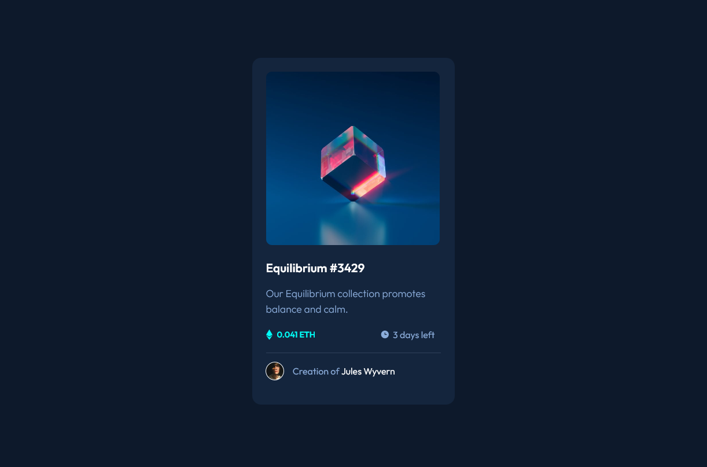

# Frontend Mentor - NFT preview card component solution

This is a solution to the [NFT preview card component challenge on Frontend Mentor](https://www.frontendmentor.io/challenges/nft-preview-card-component-SbdUL_w0U). Frontend Mentor challenges help you improve your coding skills by building realistic projects.

## Table of contents

- [Overview](#overview)
  - [The challenge](#the-challenge)
  - [Screenshot](#screenshot)
  - [Links](#links)
- [My process](#my-process)
  - [Built with](#built-with)
  - [What I learned](#what-i-learned)
- [Author](#author)
- [Acknowledgments](#acknowledgments)

## Overview

### The challenge

Users should be able to:

- View the optimal layout depending on their device's screen size
- See hover states for interactive elements

### Screenshot

### Links

- Solution URL: [https://github.com/aanacif/nft-preview-card](https://github.com/aanacif/nft-preview-card)
- Live Site URL: [https://aanacif.github.io/nft-preview-card/](https://aanacif.github.io/nft-preview-card/)

## My process

<code>
for (let coffee = 1; project != done; coffee++) {
  if (liquidDnBPlaylist) {
    return play
  }
}
<code>

### Built with

- Semantic HTML5 markup
- CSS custom properties
- Flexbox
- Pseudo elements and selectors

### What I learned

tons of fiddling with pseudo selectors

## Author

- Frontend Mentor - [@aanacif](https://www.frontendmentor.io/profile/aanacif)
- Twitter - [@aanacif](https://www.twitter.com/aanacif)

## Acknowledgments

frontendmentor FTW 👍
